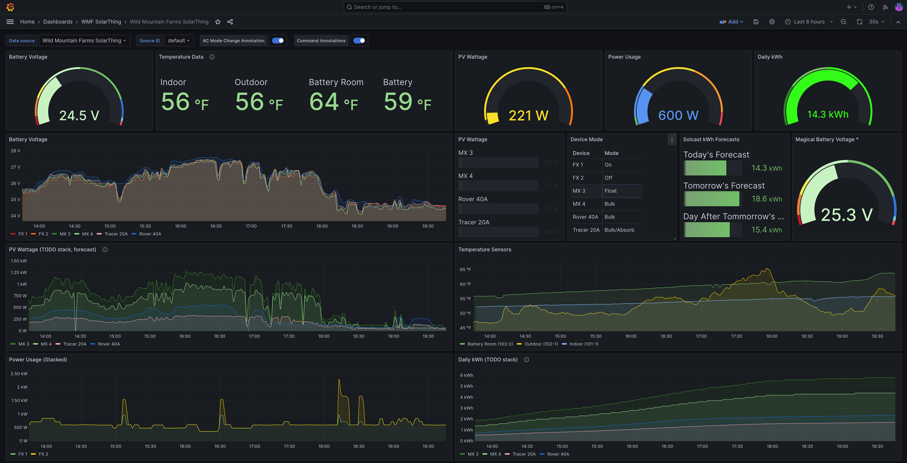

# SolarThing

Stores solar data in a database to view on Android, Grafana, or PVOutput

View full documentation at https://solarthing.readthedocs.io/

Contents

* [Supported Products](#supported-products)
* [Features](#features)
* [Viewing Your Data](#viewing-your-data)
* [Supported Databases](#supported-databases)
* [Screenshots and Examples](#screenshots-and-examples)

## Supported Products
* **Outback MATEs** (FX Inverter, MX/FM Charge Controller)
* **Renogy Rover** (And other Renogy products) over modbus serial.
  * Includes Rover, Rover Elite, Wanderer, Adventurer, Dual Input DCDC Charger, Rover Boost and possibly others
  * Compatible with all [SRNE Solar](https://www.srnesolar.com) Charge Controllers (And rebranded products)
  * Compatible with **Zenith Grape** Solar Charge Controller, **PowMr** MPPT Charge Controller, **RICH** SOLAR MPPT, **WindyNations TrakMax** MPPT
* **EPEver Tracer**
  * Includes the AN series and the TRIRON N series
  * Possibly includes the BN series (untested)
* DS18B20 Temperature Sensors and PZEM-003 and PZEM-017 Shunts

## Quickstart
Ready to install? Use the [Quickstart](https://solarthing.readthedocs.io/en/latest/quickstart/install/index.html)!

## Features
* Supports **multiple types of solar products**.
* Runs reliably **24-7**. Recovers from connection errors and has verbose logging features.
* Fully customizable through JSON (**No programming experience required**).
* Supports CouchDB, InfluxDB, local JSON file, and PVOutput exporting.
  * Multiple databases can even be used at the same time!
  * Packets are uploaded in parallel to multiple databases at the same time
* Can [report CPU temperature](https://solarthing.readthedocs.io/en/latest/config/file/base-json/request/cpu-temperature.html).
* Runs inside a Docker container

## Viewing Your Data

* Grafana (recommended)
  * Use SolarThing Server (with CouchDB) alongside [Wild GraphQL Data Source](https://grafana.com/grafana/plugins/retrodaredevil-wildgraphql-datasource/)
    * Documentation: https://solarthing.readthedocs.io/en/latest/quickstart/data/solarthing-server/index.html
  * Alternatively, configure SolarThing to upload to InfluxDB for viewing of statistics in Grafana
* [SolarThing Android](https://play.google.com/store/apps/details?id=me.retrodaredevil.solarthing.android)
  * SolarThing Android connects directly to CouchDB to display data in a persistent notification
* [PVOutput.org](https://pvoutput.org)
  * Upload your data to CouchDB, then let SolarThing upload the data inside your database to PVOutput!

If you are wondering how to set up SolarThing to view your data, you can head here: https://solarthing.readthedocs.io/en/latest/quickstart/data/index.html

## Supported Databases

* CouchDB
  * **Recommended** database and best supported database for SolarThing
  * Used with [Wild GraphQL Data Source](https://grafana.com/grafana/plugins/retrodaredevil-wildgraphql-datasource/) to view data in Grafana
  * Used with SolarThing Android to view data in the Android app
  * Used as intermediate storage before data is aggregated and uploaded to PVOutput
* InfluxDB
  * Upload statistics to InfluxDB and view them in your visualization tool of choice (Grafana is an option)
* REST API
  * With the "post" database, all packets can be posted to a URL endpoint, useful for REST APIs

## Screenshots and Examples

You can get data in [Grafana](https://github.com/grafana/grafana) via **CouchDB+SolarThing Server** or via InfluxDB (InfluxDB not recommended).

Grafana is customizable. Rearrange graphs and make it how you want!
Pre-made Grafana dashboards are coming soon.

---

PVOutput Wild Mountain Farms: [PVOutput System](https://pvoutput.org/intraday.jsp?sid=72206) and
[PVOutput SolarThing Teams](https://pvoutput.org/listteam.jsp?tid=1528)

---

SolarThing Android: [GitHub](https://github.com/wildmountainfarms/solarthing-android)
|
[Google Play](https://play.google.com/store/apps/details?id=me.retrodaredevil.solarthing.android)

SolarThing Android displays data in a persistent notification that updates at a configurable rate

## Suggestions?
If you have suggestions on how to improve the documentation or have a feature request, I'd love to
hear from you! 
[SolarThing Issues](https://github.com/wildmountainfarms/solarthing/issues)
or
[SolarThing Discussions](https://github.com/wildmountainfarms/solarthing/discussions)

Any confusion you get while setting up SolarThing is something that can be improved upon.
If you need help, ask for help!
That way we can make the documentation clearer for everyone!

---

