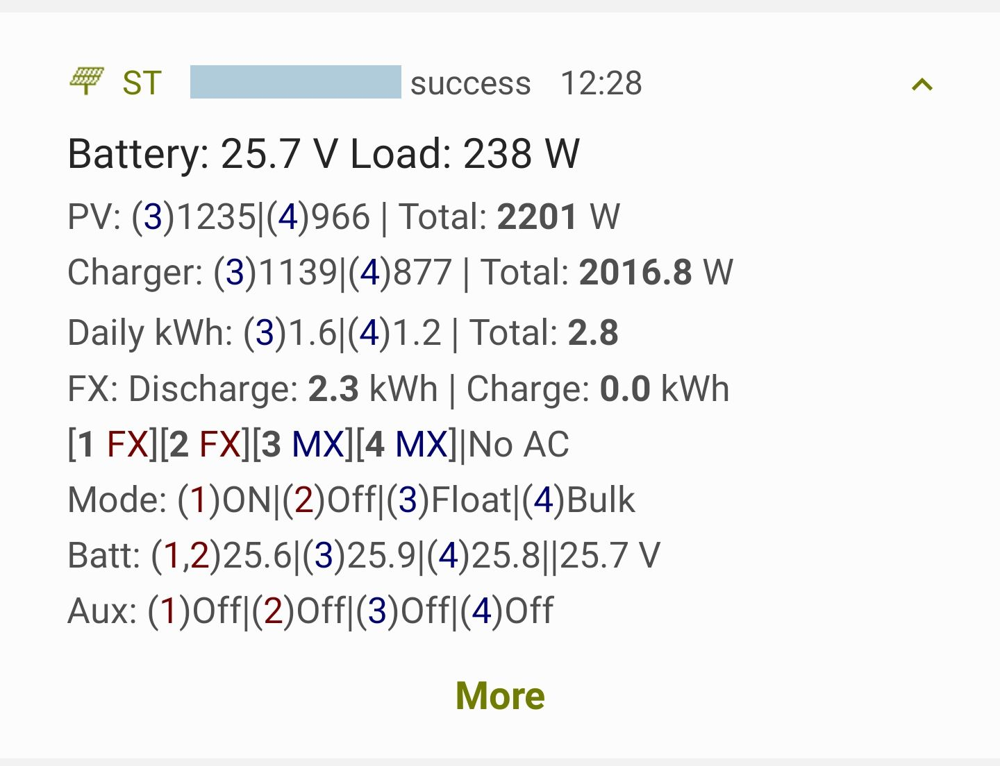

Stores solar data in a database to view on Android, Grafana, or PVOutput

## Supported Products
* <strong>Outback MATEs</strong> (FX Inverter, MX/FM Charge Controller)
* <strong>Renogy Rover</strong> (And other Renogy products) over modbus serial.

# Quickstart
Ready to install? Use the [Quickstart](docs/quickstart.md)!

# Features
* Supports **multiple types of solar products**
* Runs reliably **24-7**. Recovers from connection errors and has verbose logging features
* Fully customizable through JSON (**No programming experience required**)
* Supports CouchDB, InfluxDB, local JSON file, and PVOutput exporting

## Supported Databases
* CouchDB
  * Allows for [SolarThing Android](https://github.com/wildmountainfarms/solarthing-android) and [SolarThing Web](https://github.com/wildmountainfarms/solarthing-web) to function
  * Used for PVOutput data collection
* InfluxDB
  * Allows for viewing of data in Grafana
* [PVOutput.org](https://pvoutput.org)
  * Allows for viewing of data on [pvoutput.org](https://pvoutput.org)
  * Requires CouchDB to be set up
  * Enables usage of the [PVOutput Mycroft skill](https://github.com/wildmountainfarms/pvoutput-mycroft)

### Examples
SolarThing Android: [Github](https://github.com/wildmountainfarms/solarthing-android)
|
[Google Play](https://play.google.com/store/apps/details?id=me.retrodaredevil.solarthing.android)

SolarThing Android displays data in a persistent notification that updates at a configurable rate

If you decide to use InfluxDB, you can easily create your own Dashboard with [Grafana](https://github.com/grafana/grafana).

Grafana is very customizable. Rearrange graphs and make it how you want!

[SolarThing Web](https://github.com/wildmountainfarms/solarthing-web)

While it takes some configuring, SolarThing web is a simple way to display solar data.

## Usage at Wild Mountain Farms
We monitor an Outback MATE2 with a Raspberry Pi 1 and a Renogy Rover charge controller with a Raspberry Pi Zero W.
Both SolarThing instances upload data to CouchDB and InfluxDB, both hosted on the computer also hosting Grafana and SolarThing Web.
Another computer gets data from CouchDB and uploads it to PVOutput using the `pvoutput-upload` program.

## Using the program
You can see the [Outback/Renogy Rover](solar/README.md) README for using the program with outback or renogy products.

The [input and output](docs/input_and_outputs.md) README is documentation for the `io` JSON property option used in all of the sub programs.

### Compiling
Run `./compile_and_move.sh`.

### Database Setup
[CouchDB setup](docs/couchdb.md) 
*Used for the android and web application*

[InfluxDB setup](docs/influxdb_config.md) 
*Used for Grafana*

#### [Developer Use](docs/developer_use.md)
#### [Contributing](CONTRIBUTING.md)
#### [Technical](docs/technical/technical.md)
#### [Project Structure](docs/technical/project_structure.md)
#### [History](docs/history.md)

#### Configuration
This uses all JSON for configuring everything. The files you edit are all in one place unless you decide to move them.

See [Quickstart](docs/quickstart.md) to see how to set them up
