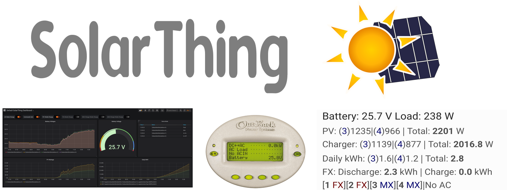
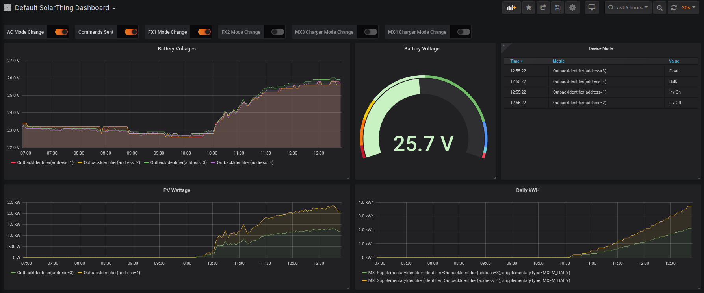
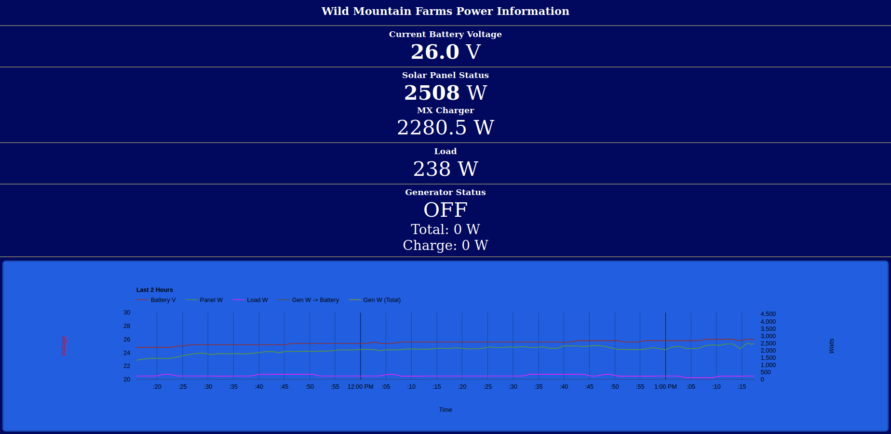

Stores solar data in a database to view on Android, Grafana, or PVOutput

    <a href="#supported-products">Supported Products</a> &bull;
    <a href="other/docs/quickstart.md">Quickstart</a> &bull;
    <a href="#features">Features</a> &bull;
    <a href="#supported-databases">Supported Databases</a> &bull;
    <a href="#examples">Examples</a>

## Supported Products
* **Outback MATEs** (FX Inverter, MX/FM Charge Controller)
* **Renogy Rover** (And other Renogy products) over modbus serial.
  * Includes Rover, Rover Elite, Wanderer, Adventurer, Dual Input DCDC Charger, and possibly others
    * Should include Rover Boost once released
  * Compatible with all [SRNE Solar](https://www.srnesolar.com) Charge Controllers (And rebranded products)
  * Compatible with **Zenith Grape** Solar Charge Controller, **PowMr** MPPT Charge Controller, **RICH** SOLAR MPPT, **WindyNations TrakMax** MPPT
* DS18B20 Temperature Sensors and PZEM-003 and PZEM-017 Shunts

# Quickstart
Ready to install? Use the [Quickstart](other/docs/quickstart.md)!

## Post installation optinos
Do any or all of these after following the quickstart. (If you haven't already click on the quickstart link above)
* [GraphQL Quickstart](other/docs/quickstart_graphql.md) - Expose CouchDB as a GraphQL API (used for Grafana)
  * This is the option I recommend most. Most people install SolarThing so they can get Grafana working
* [PVOutput Quickstart](other/docs/quickstart_pvoutput.md) - uploads to PVOutput
  * If you are interested in a nice way to view your daily kWh historical data, this is good
* [Message Quickstart (Automation program)](other/docs/quickstart_message.md) - Slack or Mattermost bot for notifications
  * Paranoid your system is gonna explode? This is a great way to monitor your system and get push notifications

# Features
* Supports **multiple types of solar products**.
* Runs reliably **24-7**. Recovers from connection errors and has verbose logging features.
* Fully customizable through JSON (**No programming experience required**).
* Supports CouchDB, InfluxDB, local JSON file, and PVOutput exporting.
  * Multiple databases can even be used at the same time!
  * Packets are uploaded in parallel to multiple databases at the same time
* Can [report Raspberry Pi CPU temperature](other/docs/raspberry_pi_cpu_temperature.md).
* Easy setup on Linux. Runs *without* root.

## Supported Databases
* CouchDB
  * Allows for [SolarThing Android](https://github.com/wildmountainfarms/solarthing-android) and [SolarThing Web](https://github.com/wildmountainfarms/solarthing-web) to function
  * Used for PVOutput data collection
* GraphQL
  * Allows use of CouchDB SolarThing data with Grafana
  * Supplements the CouchDB database
* InfluxDB
  * Simplest to set up with Grafana
* [PVOutput.org](https://pvoutput.org)
  * Allows for viewing of data on [pvoutput.org](https://pvoutput.org)
  * Requires CouchDB to be set up
  * Enables usage of the [PVOutput Mycroft skill](https://github.com/wildmountainfarms/pvoutput-mycroft)
* REST API
  * With the "post" database, all packets can be posted to a URL endpoint, useful for REST APIs

### Examples
PVOutput Wild Mountain Farms: [PVOutput System](https://pvoutput.org/intraday.jsp?sid=72206) and 
[PVOutput SolarThing Teams](https://pvoutput.org/listteam.jsp?tid=1528)

---

SolarThing Android: [Github](https://github.com/wildmountainfarms/solarthing-android)
|
[Google Play](https://play.google.com/store/apps/details?id=me.retrodaredevil.solarthing.android)

SolarThing Android displays data in a persistent notification that updates at a configurable rate

You can get data in [Grafana](https://github.com/grafana/grafana) via InfluxDB or via CouchDB+SolarThing GraphQL.

[Snapshot of Wild Mountain Farms Dashboard](https://snapshot.raintank.io/dashboard/snapshot/iPsTvb6a0eOxEtvvu58dvRuJsJ38Onnp?orgId=2)

Grafana is very customizable. Rearrange graphs and make it how you want!

---

[SolarThing Web](https://github.com/wildmountainfarms/solarthing-web) (Mostly abandon at this point)

SolarThing web uses CouchDB as its database.

---

### Can I run this?
Of course! This runs on Java 8+ and has been tested to work with Java 8 and Java 11. This runs on Linux, Windows and Mac,
but is easiest to set up on Linux systems running Debian with systemd (such as the default Raspberry Pi OS or Ubuntu).

The [quickstart](other/docs/quickstart.md) can help you get SolarThing up and running.

## Usage at Wild Mountain Farms
We monitor an Outback MATE2 with a Raspberry Pi 1 and a Renogy Rover charge controller with a Raspberry Pi Zero W.
Both SolarThing instances upload data to CouchDB, hosted on the computer also hosting Grafana and SolarThing Web.
This computer also gets data from CouchDB and uploads it to PVOutput using the `pvoutput-upload` program.

We used to also use InfluxDB for allowing easy displaying of data on Grafana, but we now use CouchDB and
SolarThing GraphQL for that.

## Using the program
You can see the [Outback/Renogy Rover](other/solar/README.md) README for using the program with outback or renogy products.

The [input and output](other/docs/input_and_outputs.md) README is documentation for the `io` JSON property option used in the rover and mate programs.

### Database Setup
* [CouchDB setup](other/docs/couchdb_setup.md) 
  * Used for SolarThing Android, SolarThing Web, and SolarThing GraphQL (which gets data to Grafana)
* [InfluxDB 2.0 setup](other/docs/influxdb2_setup.md) 
  * Used for direct Grafana queries

#### [Developer Use](other/docs/developer_use.md)
#### [Contributing](CONTRIBUTING.md)
#### [Technical](other/docs/technical/technical.md)
#### [Project Structure](other/docs/technical/project_structure.md)
#### [History](other/docs/history.md)
#### [Google Analytics](other/docs/google_analytics.md)
#### [Updating](other/docs/updating.md)

#### Configuration
This uses all JSON for configuring everything. The files you edit are all in one place unless you decide to move them.

See [Quickstart](other/docs/quickstart.md) to see how to set them up

### Renogy Rover Monitoring Alternatives
Don't like something about SolarThing? Here are some alternatives to monitor your Renogy Rover.
* https://github.com/corbinbs/solarshed
* https://github.com/logreposit/renogy-rover-reader-service
* https://github.com/menloparkinnovation/renogy-rover
* https://github.com/floreno/renogy-rover-modbus
* https://github.com/CyberRad/CoopSolar
* https://github.com/amigadad/SolarDataCollection

### Suggestions?
If you have suggestions on how to improve the documentation or have a feature request, I'd love to
hear from you! [SolarThing Issues](https://github.com/wildmountainfarms/solarthing/issues)

If you get confused while trying to configure solarthing, that's probably because the documentation is
always a work in progress. If you find something confusing, please report it, so I can make it clearer.

---

